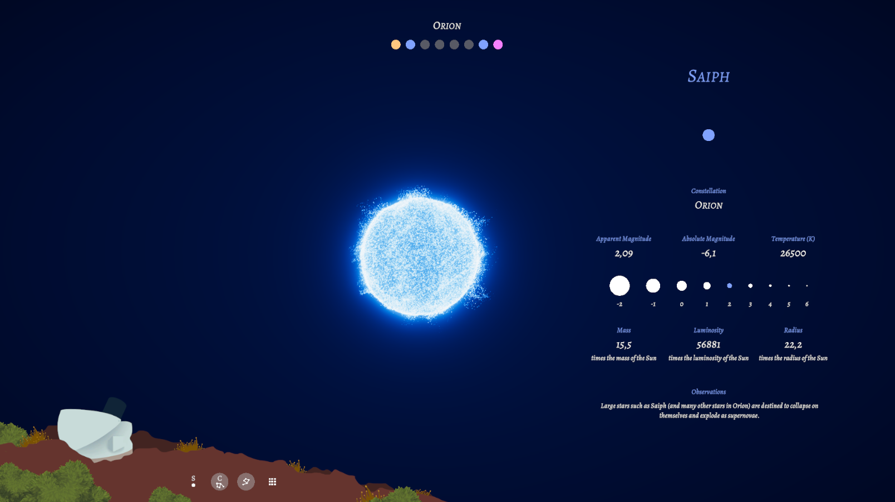
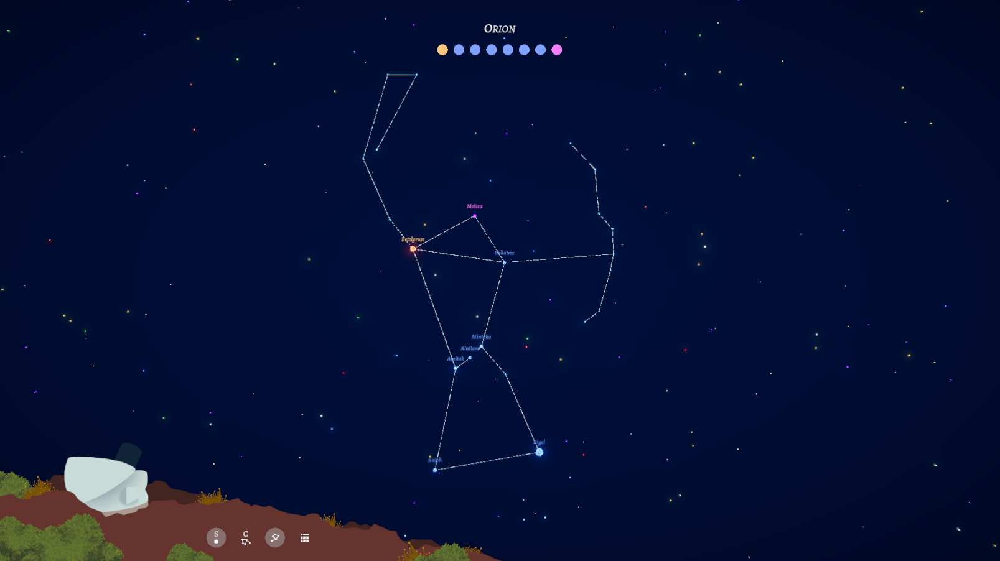
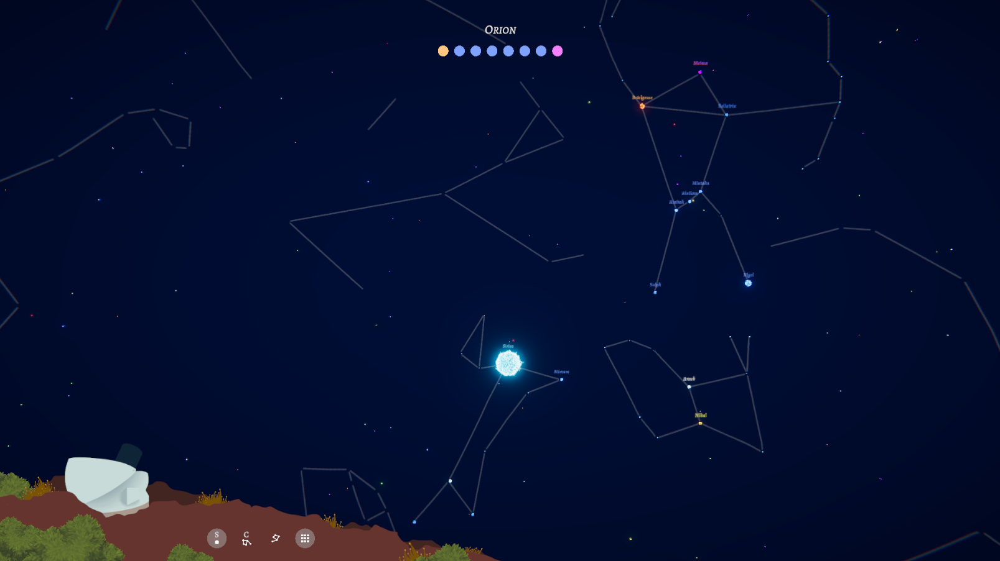

# FDV-Constellations

Constellations es un juego de exploración en el que descubriremos las estrellas y las constelaciones que conforman nuestro mapa estelar. El objetivo del proyecto es gamificar la experiencia de aprendizaje de nuestra bóveda celeste.

En primer lugar el observatorio nos pide encontrar todas las estrellas de una constelación concreta. A través de la cámara y al hacer zoom enfocando una estrella la descubriremos y nos aparecerá su panel de información así como su nombre en el mapa.

Una vez descubiertas todas las estrellas de la constelación, la desbloquearemos y obtendremos sus "líneas", pasando así a la siguiente constelación objetivo.

Ejemplo del mapa celeste con todas las constelaciones - Se trata de un pseudo-skybox con un mapa de constelaciones obtenido de una panorámica de gran calidad de la NASA.

